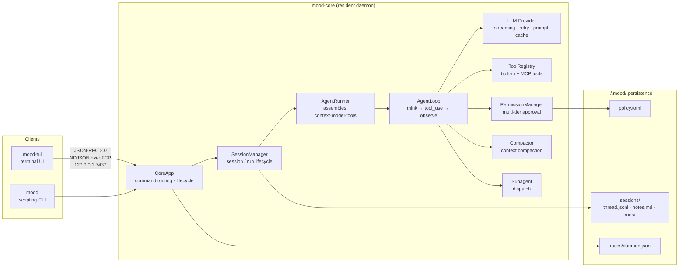

# MoodCode

**A local-first, open-source coding agent: dual-process resident architecture, six-tier permission approval, MCP and custom tools, fully auditable traces, swap-in-any-model.**

[](https://github.com/moondream69/MoodCode/actions/workflows/ci.yml)
[](LICENSE)
[](pyproject.toml#L12)
[](https://github.com/astral-sh/ruff)
[](pyproject.toml)
[](docker-compose.yml)

中文 · [English](README.en.md)

## Table of contents

- [What this is](#what-this-is)
- [Why open source](#why-open-source)
- [What you can verify](#what-you-can-verify)
- [Interface preview](#interface-preview)
- [Architecture](#architecture)
- [Features](#features)
- [Quick start](#quick-start)
- [Usage](#usage)
- [Configuration](#configuration)
- [Project layout](#project-layout)
- [Current limitations](#current-limitations)
- [What's next](#whats-next)
- [Known unwired](#known-unwired)
- [Development](#development)
- [Documentation](#documentation)
- [License](#license)

---

## What this is

MoodCode is a **coding agent that runs on your own machine**: it reads and writes files, executes commands, and reasons through a model — but **all data stays on your hardware**. Model requests go to the endpoint you configure, every permission decision happens in front of you, and the whole run is traced and replayable.

Architecturally it is **two processes**: a resident daemon (`mood-core`) owns inference and tool execution, and clients talk to it over TCP. The terminal UI (`mood-tui`) is the primary frontend — not a CLI toy. Streaming Markdown, collapsible tool calls, inline permission prompts, a sub-agent progress tree, and a live context gauge all live on one screen.

**Who it's for**: developers who want a coding agent they can **own and audit**. It speaks to any Anthropic-compatible endpoint out of the box (DeepSeek, for instance) — no vendor lock-in.

> **On the name**: `Mood` is short for the author's GitHub handle **MoonDream**, and nods at the spirit of vibe coding.
>
> **Status: early-stage (v0.0.1).** The core path — daemon ↔ client ↔ real LLM ↔ tool execution ↔ permission approval — is verified end-to-end, but interfaces may still change. **It currently suits early users who are comfortable with a terminal and Docker and willing to read docs** — see [Current limitations](#current-limitations) and [What's next](#whats-next).

---

## Why open source

Coding agents are turning into black boxes. One can read your code, run commands, and see your entire directory tree — and you have **no way to confirm what it sends where**. Vendors say your data never leaves, but you cannot check. That isn't a conspiracy theory; it's what closed-source software is.

MoodCode's answer isn't a promise. It's **putting every step where you can see it**:

- **Runs on your machine** — model requests go to the endpoint you configure, through no intermediary
- **Runs where you can read it** — protocol, permission logic, and traces are all inspectable, not "trust me"
- **Runs where you can change it** — which tools, which permissions, which model: configuration, not feature requests

The project is young and nowhere near replacing mature tools. But it is at least a **watch you can take the back off**.

---

## What you can verify

"Open source and auditable" shouldn't be a slogan. Here are three verification paths, each backed by a concrete implementation:

**① All the code is here.** No closed components, no prebuilt binaries, no hidden network calls. JSON-RPC over TCP (`transport/`), the tool invocation pipeline (`tools/invocation.py`), LLM request construction (`llm/provider.py`) — every line is in the repository.

**② Permissions are adjudicated explicitly, and persist.** Every tool call passes six tiers of approval, and the **"out-of-scope forced ask" tier cannot be bypassed by any cache** — touching a path outside the working directory (absolute paths, `~`, `..`, `$HOME`, `cd`) always prompts. Your decisions land in `~/.mood/policy.toml`, readable as plain text.

**③ Full traces land on disk and replay.** Every IPC message, every bus event, and **complete LLM request/response pairs** are written to `~/.mood/traces/daemon.jsonl`. `mood trace --layer llm` shows exactly what the model received. The protocol itself isn't prose — it's generated from the pydantic models, and CI verifies the document matches the code.

---

## Interface preview

Startup banner, streaming output, collapsible tool calls, and inline permission prompts — all on one screen:


<sub>`run` / `step` progress, token counts with the context gauge, and two `permission bash` request lines.</sub>

As the conversation proceeds, permission prompts appear inline in the log stream instead of interrupting it; finished runs show `✓ completed` with a step count:


<sub>`> Allow once` marks the cursor; `y/1` `a/2` `n/3` `d/4` are hotkeys. The box at the bottom is the multi-line input.</sub>

---

## Architecture


MoodCode uses a **two-process** design: the daemon stays resident while clients connect and disconnect freely.



**Why two processes:**

- **Sessions outlive clients** — disconnect the CLI, connect the TUI, and the session is still waiting for input
- **Execution decoupled from display** — long tasks keep running in the background; a crashed client doesn't affect the daemon
- **A single permission chokepoint** — every tool call goes through the same `PermissionManager`, with policy persisted daemon-side

**Layered view:** the diagram above is organized into seven layers — entry, protocol, runtime core, agent capability, governance & memory, extension ecosystem, and evidence — showing the full path from user intent to durable artifacts.

---

## Features

### Terminal interface (primary frontend)

- **Streaming output** — LLM tokens accumulate and render as Markdown live, rather than arriving as one block
- **Collapsible tool calls** — each call shows a one-line summary (path / command preview, status, elapsed ms); click to expand full params and output
- **Inline permission prompts** — approval appears directly in the log stream instead of a modal; hotkeys `y`/`a`/`n`/`d`
- **Sub-agent progress tree** — tasks dispatched via `spawn_agent` render as `┌─` / `└─` tree lines, with child step events folded to avoid flooding
- **Context gauge** — input/output/cache token counts after each LLM call, plus a 20-cell colored usage bar (yellow at 70%, red at 85%)
- **Slash completion** — typing `/` autocompletes available skills and built-in commands

### Permission governance

Every tool call is evaluated by the **`PermissionManager`** in a fixed order:

| Order | Tier | Behavior |
|---|---|---|
| 1 | `deny_patterns` | bash command blocklist, evaluated first |
| 2 | **Out-of-scope forced ask** | Paths outside the CWD (absolute, `~`, `..`, `$HOME`, `cd`) **always prompt — no cache can bypass this** |
| 3 | Session-level always cache | "Always allow/deny" decisions made in this session |
| 4 | Persistent always cache | Cross-session decisions from `~/.mood/policy.toml` |
| 5 | `allow_patterns` | bash command allowlist |
| 6 | Tool default | Unknown tools default to asking |

Defaults: `bash` and `write_file` ask; `read_file`, `list_dir`, and `note_save` are allowed. Approvals time out after 60 seconds (configurable) and deny; a client disconnect resolves all pending requests to deny.

### Extension mechanisms

- **Skills** — triggered with `/<name>`, each able to restrict the tool whitelist. Built-ins: `init` (analyze a project into `.mood/context.md`), `orchestrate` (planner→executor→reviewer workflow), `review` (code review), `summarize` (session summary). Lookup order: `.mood/skills/` → `~/.mood/skills/` → built-in
- **Agent profiles** — preset sub-agent personas; built-ins `planner` / `executor` / `reviewer`, each with a restricted toolset. Same lookup order
- **MCP** — connect external tool ecosystems over `stdio` or `tcp`. Tools register as `<server>__<tool>`
- **Sub-agents** — `spawn_agent` dispatches an isolated task (cold start, no parent context), supporting blocking foreground and background polling via `agent_result`; nesting depth capped at 2

### Context management

- **Tool-result truncation** — historical tool results over 8000 chars are truncated on read to the first 4000 plus an omission marker
- **Manual compaction** — `/compact` in the TUI compresses the conversation into a six-section summary (original goal / completed steps / key constraints / current file state / remaining TODOs / critical data); the old `thread.jsonl` is backed up to `thread_<ts>.jsonl.bak`
- **Automatic compaction** — triggered by context usage, **off by default**

### Observability

- **Session notes** — the `note_save` tool appends facts to `notes.md`, automatically injected into the system prompt on the next run
- **Trace** — all IPC messages, bus events, and full LLM request/response pairs are written to `~/.mood/traces/daemon.jsonl` (NDJSON); inspect with `mood trace`, filtering by layer/direction or following with `--follow`
- **Run events** — each run's event stream lands in `runs/<run_id>/events.jsonl`; replay with `mood-tui --replay <run_id>`

---

## Quick start

### Requirements

- **Docker** (recommended) — consistent across platforms, integration tests runnable
- Or Linux / macOS natively (**Windows cannot run the daemon natively** — see [Current limitations](#current-limitations))
- An Anthropic API key, **or** any Anthropic-compatible endpoint (e.g. DeepSeek)

### 1. Configure credentials

```bash
cp .env.example .env
# Edit .env and fill in at least ANTHROPIC_API_KEY
```

<details>
<summary>Using a third-party Anthropic-compatible endpoint (e.g. DeepSeek)</summary>

```bash
ANTHROPIC_BASE_URL=https://api.deepseek.com/anthropic
MOOD_LLM_DEFAULT_MODEL=deepseek-v4-pro
```

Note: if you don't set an explicit model name, the server may silently fall back to a cheaper tier.

</details>

### 2. Start the daemon

```bash
docker compose up -d       # build and start
docker compose ps          # expect: Up (healthy)
uv run mood ping           # verify from the host
```

`pong server=0.0.1 uptime=... latency=...` means the link is healthy.

### 3. Open the interface

```bash
uv run mood-tui
```

---

## Usage

### Terminal UI keybindings

| Key | Action |
|---|---|
| `Enter` | Submit message |
| `Ctrl+J` / `Alt+Enter` | Newline |
| `Ctrl+Q` | Quit |
| `↑` / `↓` | Navigate permission widget and completion menu |
| `y`/`1`, `a`/`2`, `n`/`3`, `d`/`4` | Permission decision: allow once / always allow / deny / always deny |

### Slash commands

Type `/` to trigger completion. `/compact` is a built-in command (compacts context immediately); other `/name` input is resolved server-side to the matching skill.

### CLI

```bash
uv run mood ping                                   # connectivity check
uv run mood run --goal "Summarize README.md"        # one-shot task
uv run mood chat                                   # multi-turn conversation
uv run mood trace                                  # view trace
uv run mood trace --layer llm --follow             # LLM layer only, streaming
uv run mood core start|stop|status                 # daemon lifecycle (PID file)
```

> The CLI is a scripting and debugging tool, **not the product interface**. The TUI is the reference frontend.

---

## Configuration

Precedence (low → high):

```
built-in defaults → ~/.mood/config.toml → .mood/config.toml (project) → .env → environment variables
```

- Setting `MOOD_CONFIG` reads **only** that file, skipping the other TOMLs
- `.env` is loaded **before** `MOOD_CONFIG` is read, so `MOOD_CONFIG` itself can live in `.env`
- A missing config file is silently skipped; **an unknown section or key exits the process** (not a warning)

See [`.env.example`](.env.example) for every key with inline comments (8 sections covering core / logging / agent / llm / trace / permission / compaction / mcp).

### Data directory

Under Docker, `~/.mood` is mounted to the named volume `moodcode_mood-data`; `docker compose down` will not delete it.

```
~/.mood/
├── sessions/<sid>/
│   ├── meta.json              # session metadata
│   ├── thread.jsonl           # full message stream (Anthropic format, append-only)
│   ├── notes.md               # agent-authored facts
│   └── runs/<run_id>/events.jsonl
├── traces/daemon.jsonl        # full IPC / event / LLM timeline
├── policy.toml                # persisted permission decisions
└── logs/core.log
```

---

## Project layout

```
src/mood_code/
├── core/                  # the daemon
│   ├── app.py             # CoreApp: startup pipeline + RPC routing
│   ├── loop.py            # AgentLoop: think → tool_use → observe
│   ├── runner.py          # AgentRunner: assembles context, model, tools
│   ├── bus/               # protocol layer: Command / Event discriminated unions (pydantic v2)
│   ├── transport/         # TCP server/client, IPC event broadcasting
│   ├── session/           # session lifecycle and on-disk persistence
│   ├── tools/             # tool base class, built-ins, invocation pipeline
│   ├── permissions/       # multi-tier approval and policy persistence
│   ├── compact/           # context compaction and token budget
│   ├── subagent/          # sub-agent dispatch
│   ├── skills/            # skill loader and built-in skills
│   ├── agents/            # agent profile loader and built-in profiles
│   ├── mcp/               # MCP client / server manager / tool wrapper
│   ├── llm/               # LLM provider (Anthropic SDK)
│   └── trace/             # trace writer and LLM payload capture
├── cli/                   # mood: scripting CLI
└── tui/                   # mood-tui: Textual terminal UI (primary frontend)
```

---

## Current limitations

All of the following are **verified behaviors**, not a to-do list:

- **Windows cannot run the daemon natively.** `core/app.py` calls `asyncio.add_signal_handler()` unconditionally, which is Unix-only. Config, logging, permissions, session storage, the provider, and the socket server all work, and the port even binds — it crashes only at the signal-handling step. **Use Docker instead.**
- **The daemon refuses to start without `ANTHROPIC_API_KEY`**, even for a bare `mood ping` — the provider is constructed before `server.start()`. Integration tests need a placeholder value too.
- **Sessions do not survive a daemon restart.** The session index is in memory; old session IDs return `SESSION_NOT_FOUND` after a restart. The only recovery is `mood-tui --replay <run_id>`, which replays historical events.
- **The TUI creates a new session on every connect** — there is no session list, switcher, or resume UI.
- **Sub-agents cannot access MCP tools**; their toolset is limited to built-in file, bash, and task tools (plus `spawn_agent` when nesting).
- **MCP only handles text content** — images and resources are dropped, and server-initiated notifications are ignored.
- **Automatic compaction is off by default** (`compaction.auto_threshold = 0`); use `/compact` manually.
- **An unrecognized `/foo` does not error** — it is passed to the model as plain text.
- **The trace file never rotates**, so it grows unbounded over long runs.

### An honest note on the bar to entry

These aren't a defect list — they're an **honest description of the current stage**. For a project whose whole pitch is auditability, cherry-picking the flattering parts of the documentation would be worse than being closed-source.

Taken together, MoodCode **is not yet a turnkey product**: you need to be comfortable with a terminal and Docker, willing to read docs, and willing to accept that interfaces may change. If what you want is something you install and immediately use to replace your current tools, now isn't the time. But if you want a coding agent you can **own and take the back off**, and you're willing to help push it to usable — the full path already works end to end.

---

## What's next

Ordered by priority; each is a concrete, verifiable artifact:

| Order | Item | Status |
|---|---|---|
| 1 | **CI automation** | Wired up (see the badge above); next is making the integration tests a stable part of every run |
| 2 | **Ship a pip package and prebuilt image** | Today it takes a clone plus `docker compose up` — the main source of friction |
| 3 | **Sessions surviving a daemon restart** | The session index is in memory, so a restart loses it — the most awkward capability gap |
| 4 | **Clear out the known-unwired items** | See the next section: seven config keys / code paths that are parsed but never consumed |
| 5 | **Native Windows support** | Windows users currently must go through Docker |

---

## Known unwired

The following config keys and code paths **exist but are never consumed**. Seeing them does not mean the feature works — worth knowing before contributing:

| Item | Actual behavior |
|---|---|
| `llm.router` | Assigned but never read; the provider always reports `strategy="static"` |
| `compaction.tool_result_limit` / `tool_result_keep` | Parsed, but `session/store.py` uses the module constants 8000/4000 from `compact/budget.py` |
| Agent profile `model` field | Parsed, but sub-agents inherit the parent provider's model |
| `CoreStartedEvent`, `LogLineEvent` | Defined and in the union, never published anywhere |
| `PermissionDeniedError` | Defined, never raised |
| `session.get_history` | RPC handler is registered, but no shipped client calls it |
| `McpServerManager.register_tools` and others | Several methods with no callers; see [`AGENTS.md`](AGENTS.md) |

Also note that `scripts/gen_protocol_doc.py`'s model coverage must stay in sync with `bus/` — regenerate `WIRE_PROTOCOL.md` whenever protocol models change.

---

## Development

```bash
uv sync                                 # install / sync dependencies
uv run ruff check src tests scripts     # lint
uv run mypy src                         # type check (strict)
uv run pytest tests/unit -v             # unit tests
uv run pytest tests/integration -v      # integration tests (not runnable on Windows)
```

The `Makefile` provides `lint` / `test` / `integration-test` / `docs` / `verify` targets; `verify` is the full pre-commit gate (dependencies → lint + types → unit tests → smoke connectivity → protocol doc in sync).

**Running tests in a container** (the only way to run integration tests on Windows):

```bash
docker build --target test -t moodcode-core:test .
docker run --rm moodcode-core:test pytest tests/unit -q
docker run --rm -e ANTHROPIC_API_KEY=ci-placeholder moodcode-core:test pytest tests/integration -v
```

### Code conventions

- **Function comments**: a single-line comment directly above `def` describing what it does; no multi-line docstrings
- **Test comments**: every test function must have two lines above it — `# 功能：` (what behavior is verified) and `# 设计：` (why it's tested this way)
- Adding a command or event means adding a pydantic model class **and** extending the matching `Command` / `Event` union in `bus/`

See [`AGENTS.md`](AGENTS.md) for details.

---

## Documentation

| Document | Contents |
|---|---|
| [`RUNBOOK.md`](RUNBOOK.md) | Operations manual: both run modes, full config table, state directory, logging & tracing, troubleshooting |
| [`AGENTS.md`](AGENTS.md) | Contributor- and agent-facing architecture notes: subsystem map, tool-system conventions, code style |
| [`WIRE_PROTOCOL.md`](WIRE_PROTOCOL.md) | Complete IPC protocol spec (generated from the pydantic models by `scripts/gen_protocol_doc.py`) |

---

## License

[MIT](LICENSE) © 2026 moondream69
