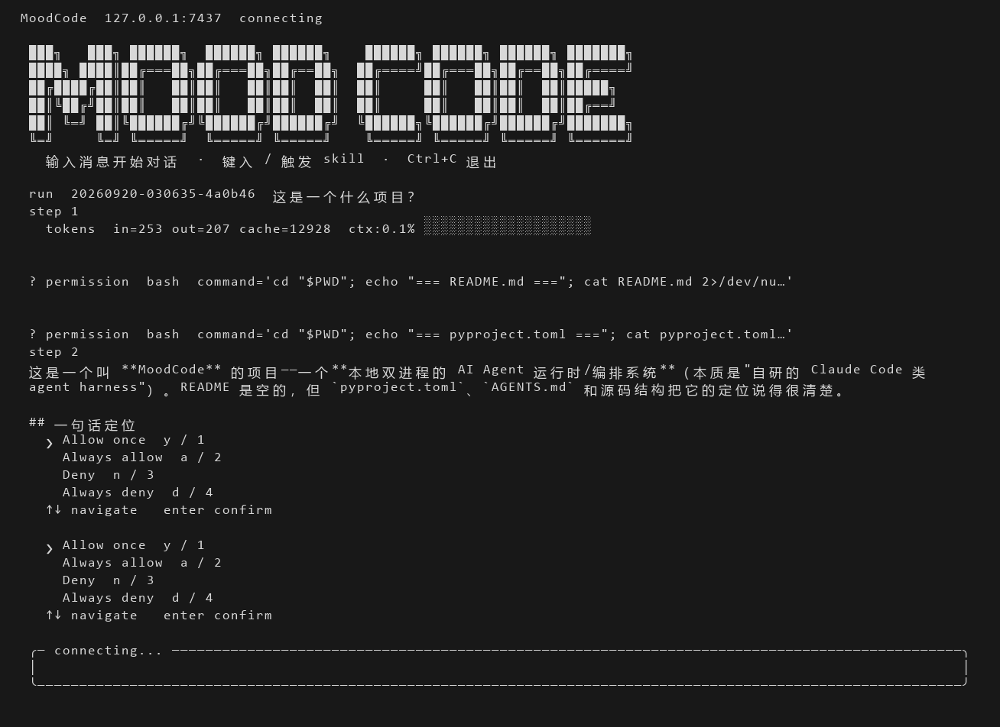
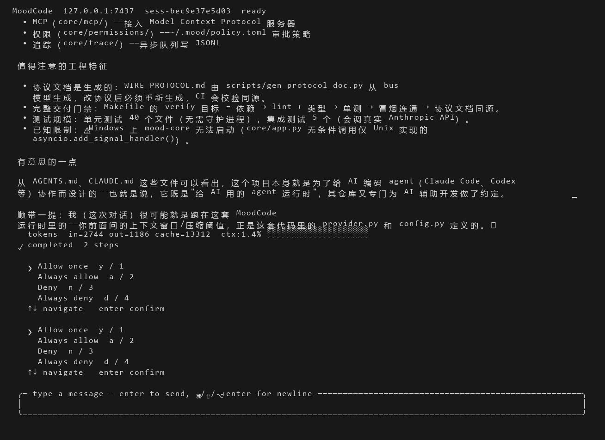
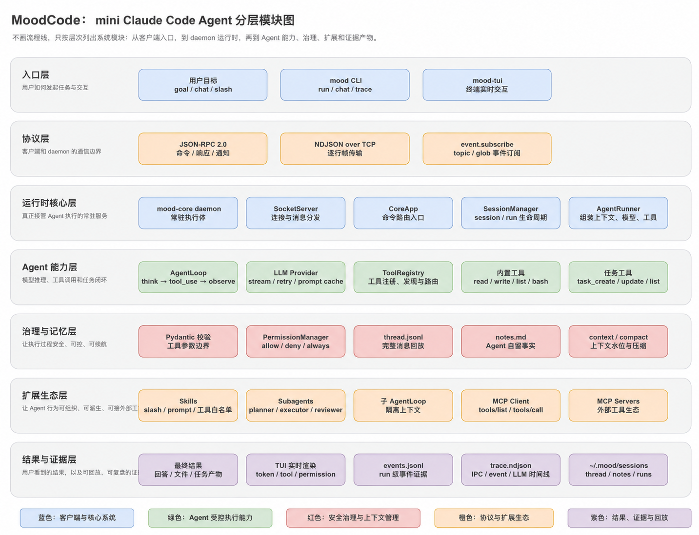
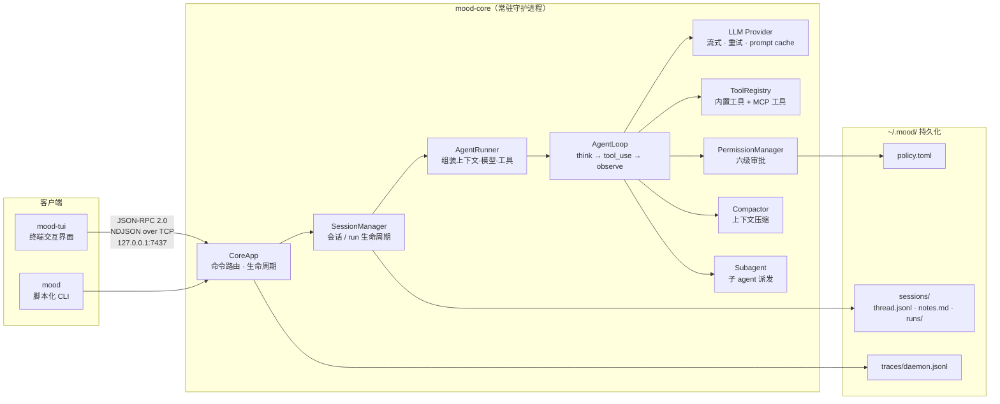

# MoodCode

**一个双进程架构的本地 AI Agent 系统：常驻守护进程 + 终端交互界面。**

[](LICENSE)
[](pyproject.toml#L12)
[](https://github.com/astral-sh/ruff)
[](pyproject.toml)
[](tests/unit)
[](docker-compose.yml)

[English](README.en.md) · 中文

---

MoodCode 把「模型推理」「工具执行」「权限治理」「会话持久化」拆进一个可长期驻留的守护进程（`mood-core`），客户端通过 JSON-RPC 2.0 over TCP 与它通信。

**终端 UI（`mood-tui`）是主前端**，不是命令行玩具——它带流式 Markdown 渲染、可折叠的工具调用、内联权限审批、子 agent 树状进度、实时上下文水位指示。CLI（`mood`）只承担脚本化与调试职责。

> **状态：早期项目（v0.0.1）。** 核心链路（daemon ↔ 客户端 ↔ 真实 LLM ↔ 工具执行 ↔ 权限审批）已端到端跑通，但接口仍可能变动，且存在若干已知未接线项，见[已知未接线](#已知未接线)。

---

## 界面预览

启动横幅、流式输出、可折叠工具调用与内联权限控件，全部在同一屏内：



<sub>启动横幅（今天修的顶部对齐缺陷在此可见）、`run` / `step` 进度、tokens 与上下文水位条、以及两条 `permission bash` 请求行。</sub>

对话推进后，权限审批控件直接内联在日志流里，不打断阅读；完成的 run 显示 `✓ completed` 与步数：



<sub>`> Allow once` 为当前光标位，`y/1` `a/2` `n/3` `d/4` 为快捷键；底部为多行输入框。</sub>

---

## 目录

- [架构](#架构)
- [核心功能](#核心功能)
- [快速开始](#快速开始)
- [使用](#使用)
- [配置](#配置)
- [项目结构](#项目结构)
- [当前限制](#当前限制)
- [已知未接线](#已知未接线)
- [开发](#开发)
- [文档](#文档)
- [许可证](#许可证)

---

## 架构



MoodCode 采用**双进程**设计：守护进程常驻，客户端可随时连上或断开，互不影响。



**为什么拆两个进程：**

- **会话可跨客户端存活** —— CLI 断开后 TUI 连上，会话仍在等待输入
- **执行与展示解耦** —— 长任务在后台跑，客户端崩了不影响守护进程
- **单一权限决策点** —— 所有工具调用都经过同一个 `PermissionManager`，策略持久化在 daemon 侧

**分层说明：** 上图按「入口层 / 协议层 / 运行时核心层 / Agent 能力层 / 治理与记忆层 / 扩展生态层 / 结果与证据层」七层展开，展示了从用户意图到证据产物的完整路径。

---

## 核心功能

### 终端界面（主前端）

- **流式输出** —— LLM token 实时累积并渲染为 Markdown，而不是等整段返回
- **可折叠工具调用** —— 每个工具调用显示为一行摘要（路径 / 命令预览 + 状态 + 耗时），点击展开完整参数与输出
- **内联权限审批** —— 需要授权的工具调用直接在日志流中弹出选择控件，无需模态框打断；支持快捷键 `y`/`a`/`n`/`d`
- **子 agent 树状进度** —— `spawn_agent` 派发的子任务以 `┌─` / `└─` 树形展示，子步骤事件自动折叠，避免刷屏
- **上下文水位** —— 每次 LLM 调用后展示输入/输出/cache token 数，外加 20 格彩色水位条（70% 转黄、85% 转红）
- **Slash 命令补全** —— 输入 `/` 自动补全可用 skill 与内置命令

### 权限治理

所有工具调用都经过 **`PermissionManager`**，按固定顺序求值：

| 顺序 | 层级 | 说明 |
|---|---|---|
| 1 | `deny_patterns` | bash 命令黑名单，最先判定 |
| 2 | **越界强制询问** | 触碰 CWD 之外的路径（绝对路径 / `~` / `..` / `$HOME` / `cd`）**强制 ASK，任何缓存都无法绕过** |
| 3 | 会话级 always 缓存 | 本次会话内你选过的「始终允许/拒绝」 |
| 4 | 持久化 always 缓存 | `~/.mood/policy.toml` 里的跨会话决策 |
| 5 | `allow_patterns` | bash 命令白名单 |
| 6 | 工具默认策略 | 未知工具一律 ASK |

默认策略：`bash` 与 `write_file` 询问，`read_file` / `list_dir` / `note_save` 放行。审批超时（默认 60 秒）自动拒绝；客户端断连时所有待决请求解析为拒绝。

### 扩展机制

- **Skills** —— `/<name>` 触发，可为每个 skill 限定工具白名单。内置 `init`（分析项目生成 `.mood/context.md`）、`orchestrate`（planner→executor→reviewer 编排）、`review`（代码审查）、`summarize`（会话摘要）。搜索顺序：`.mood/skills/` → `~/.mood/skills/` → 内置
- **Agent Profiles** —— 预设的子 agent 人格，内置 `planner` / `executor` / `reviewer`，各自限定工具集。搜索顺序同上
- **MCP** —— 接入外部工具生态，支持 `stdio` 与 `tcp` 两种传输。工具以 `<服务器名>__<工具名>` 注册进 registry
- **Sub-agents** —— `spawn_agent` 派发隔离子任务（冷启动，不带父上下文），支持前台阻塞与后台轮询（`agent_result`），嵌套深度上限 2

### 上下文管理

- **工具结果截断** —— 超过 8000 字符的历史工具结果，读取时截断为前 4000 字符 + 省略标记
- **手动压缩** —— TUI 里 `/compact`，把整段对话压缩为六段式摘要（原始目标 / 已完成步骤 / 关键约束 / 当前文件状态 / 剩余 TODO / 关键数据），原 `thread.jsonl` 备份为 `thread_<ts>.jsonl.bak`
- **自动压缩** —— 按上下文水位触发，**默认关闭**

### 可观测性

- **会话笔记** —— `note_save` 工具把事实追加到 `notes.md`，下次 run 自动注入 system prompt
- **Trace** —— 所有 IPC 消息、总线事件、完整的 LLM 请求/响应对写入 `~/.mood/traces/daemon.jsonl`（NDJSON），`mood trace` 可查看，支持按层/方向过滤与 `--follow` 跟踪
- **运行事件** —— 每次 run 的事件流落在 `runs/<run_id>/events.jsonl`，`mood-tui --replay <run_id>` 可回放

---

## 快速开始

### 前置要求

- **Docker**（推荐）—— 跨平台一致，集成测试可跑
- 或 Linux / macOS 本地运行（**Windows 不支持本地启动守护进程**，见[当前限制](#当前限制)）
- 一个 Anthropic API key，**或**任意 Anthropic 兼容端点（如 DeepSeek）

### 1. 配置密钥

```bash
cp .env.example .env
# 编辑 .env，至少填入 ANTHROPIC_API_KEY
```

<details>
<summary>使用第三方 Anthropic 兼容端点（例：DeepSeek）</summary>

```bash
ANTHROPIC_BASE_URL=https://api.deepseek.com/anthropic
MOOD_LLM_DEFAULT_MODEL=deepseek-v4-pro
```

注意：不显式设置模型名时，服务端可能把未知模型静默回退到便宜档位。

</details>

### 2. 启动守护进程

```bash
docker compose up -d       # 构建并启动
docker compose ps          # 期望：Up (healthy)
uv run mood ping           # 从宿主机验证
```

`pong server=0.0.1 uptime=... latency=...` 即表示链路通畅。

### 3. 打开界面

```bash
uv run mood-tui
```

---

## 使用

### 终端界面快捷键

| 按键 | 作用 |
|---|---|
| `Enter` | 提交消息 |
| `Ctrl+J` / `Alt+Enter` | 换行 |
| `Ctrl+Q` | 退出 |
| `↑` / `↓` | 权限控件与补全菜单中导航 |
| `y`/`1`、`a`/`2`、`n`/`3`、`d`/`4` | 权限决策：允许一次 / 始终允许 / 拒绝 / 始终拒绝 |

### Slash 命令

输入 `/` 触发补全。`/compact` 为内置命令（立即压缩上下文），其余 `/name` 由守护进程解析为对应 skill。

### CLI

```bash
uv run mood ping                                  # 连通性检查
uv run mood run --goal "总结 README.md 的主要章节"   # 单次任务
uv run mood chat                                  # 多轮对话
uv run mood trace                                 # 查看 trace
uv run mood trace --layer llm --follow            # 只看 LLM 层并持续跟踪
uv run mood core start|stop|status                # 守护进程生命周期（PID 文件）
```

> CLI 是脚本化与调试工具，**不是产品界面**。完整功能以 TUI 为准。

---

## 配置

配置优先级（低 → 高）：

```
内建默认值 → ~/.mood/config.toml → .mood/config.toml（项目级） → .env → 系统环境变量
```

- 设了 `MOOD_CONFIG` 则**只**读该文件，跳过其余 TOML
- `.env` 在读取 `MOOD_CONFIG` **之前**加载，所以 `MOOD_CONFIG` 本身可以写在 `.env` 里
- 配置文件不存在则静默跳过；**出现未知小节或未知键会直接退出进程**（不是警告）

完整键位与注释见 [`.env.example`](.env.example)（8 个小节，覆盖 core / logging / agent / llm / trace / permission / compaction / mcp）。

### 数据目录

容器方式下 `~/.mood` 挂载到命名卷 `moodcode_mood-data`，`docker compose down` 不会删除。

```
~/.mood/
├── sessions/<sid>/
│   ├── meta.json              # 会话元信息
│   ├── thread.jsonl           # 完整消息流（Anthropic 格式，追加写）
│   ├── notes.md               # Agent 自留事实
│   └── runs/<run_id>/events.jsonl
├── traces/daemon.jsonl        # IPC / 事件 / LLM 全量时间线
├── policy.toml                # 持久化权限决策
└── logs/core.log
```

---

## 项目结构

```
src/mood_code/
├── core/                  # 守护进程
│   ├── app.py             # CoreApp：启动管线 + RPC 命令路由
│   ├── loop.py            # AgentLoop：think → tool_use → observe
│   ├── runner.py          # AgentRunner：组装上下文、模型、工具
│   ├── bus/               # 协议层：Command / Event 判别联合（pydantic v2）
│   ├── transport/         # TCP server/client、IPC 事件广播
│   ├── session/           # 会话生命周期与磁盘持久化
│   ├── tools/             # 工具基类、内置工具、调用管线
│   ├── permissions/       # 六级审批与策略持久化
│   ├── compact/           # 上下文压缩与 token 预算
│   ├── subagent/          # 子 agent 派发
│   ├── skills/            # skill 加载器与内置 skill
│   ├── agents/            # agent profile 加载器与内置 profile
│   ├── mcp/               # MCP client / server manager / tool 包装
│   ├── llm/               # LLM provider（Anthropic SDK）
│   └── trace/             # trace 写入与 LLM 载荷采集
├── cli/                   # mood：脚本化 CLI
└── tui/                   # mood-tui：Textual 终端界面（主前端）
```

---

## 当前限制

以下均为**实测确认**的行为，不是待办清单：

- **Windows 无法本地启动守护进程。** `core/app.py` 无条件调用 `asyncio.add_signal_handler()`，该 API 仅 Unix 实现。配置、日志、权限、会话存储、provider、socket server 全部正常，端口也已监听，仅在最后的信号处理步骤崩溃。**用容器绕开**，或参考[开发](#开发)一节。
- **守护进程必须有 `ANTHROPIC_API_KEY` 才能启动**，哪怕只跑 `mood ping`——provider 在 `server.start()` 之前构造。集成测试也需传占位值。
- **会话不跨守护进程重启。** 会话索引在内存中，daemon 重启后旧 session id 返回 `SESSION_NOT_FOUND`。唯一的「恢复」能力是 `mood-tui --replay <run_id>` 回放历史事件。
- **TUI 每次连接都新建会话**，没有会话列表 / 切换 / 恢复界面。
- **子 agent 拿不到 MCP 工具**，其工具集限于内置的文件、bash 与 task 工具（嵌套时另加 `spawn_agent`）。
- **MCP 只处理 text 类型的内容**，图片与 resource 会被丢弃；忽略服务端主动通知。
- **自动压缩默认关闭**（`compaction.auto_threshold = 0`），需手动 `/compact`。
- **未识别的 `/foo` 不报错**，会被当作普通文本发给模型。
- **trace 文件无轮转**，长期运行会持续增长。

---

## 已知未接线

以下配置项 / 代码**存在但从不被消费**。看到它们不代表功能已生效——贡献时请留意：

| 项 | 实际行为 |
|---|---|
| `llm.router` | 只赋值从不读；provider 恒发 `strategy="static"` |
| `compaction.tool_result_limit` / `tool_result_keep` | 被解析，但 `session/store.py` 用的是 `compact/budget.py` 的模块常量 8000/4000 |
| agent profile 的 `model` 字段 | 被解析，但子 agent 实际继承父 provider 的模型 |
| `CoreStartedEvent`、`LogLineEvent` | 已定义并入 union，全仓库从不发布 |
| `PermissionDeniedError` | 已定义，从不 raise |
| `session.get_history` | RPC handler 已注册，但没有任何客户端调用 |
| `McpServerManager.register_tools` 等 | 若干未被调用的方法，详见 [`AGENTS.md`](AGENTS.md) |

此外 `scripts/gen_protocol_doc.py` 的模型覆盖需要与 `bus/` 保持同步，改协议模型时务必重新生成 `WIRE_PROTOCOL.md`。

---

## 开发

```bash
uv sync                                 # 安装 / 同步依赖
uv run ruff check src tests scripts     # lint
uv run mypy src                         # 类型检查（strict）
uv run pytest tests/unit -v             # 单元测试
uv run pytest tests/integration -v      # 集成测试（Windows 不可运行）
```

`Makefile` 提供 `lint` / `test` / `integration-test` / `docs` / `verify` 目标，其中 `verify` 是提交前的完整门禁（依赖 → lint + 类型 → 单元测试 → 冒烟连通 → 协议文档同源）。

**在容器里跑测试**（Windows 下唯一可行的集成测试方式）：

```bash
docker build --target test -t moodcode-core:test .
docker run --rm moodcode-core:test pytest tests/unit -q
docker run --rm -e ANTHROPIC_API_KEY=ci-placeholder moodcode-core:test pytest tests/integration -v
```

### 代码风格约定

- **函数注释**：`def` 正上方一行中文注释说明该函数做什么，不写多行 docstring
- **测试注释**：每个测试函数上方必须有 `# 功能：`（测什么）与 `# 设计：`（为什么这样测）两行中文注释
- 新增命令或事件 = 新增一个 pydantic 模型类 + 扩展 `bus/` 里对应的 `Command` / `Event` union

细节见 [`AGENTS.md`](AGENTS.md)。

---

## 文档

| 文档 | 内容 |
|---|---|
| [`RUNBOOK.md`](RUNBOOK.md) | 运维手册：两种运行方式、配置全表、状态目录、日志与追踪、常见错误排查 |
| [`AGENTS.md`](AGENTS.md) | 面向贡献者与 AI agent 的架构说明：子系统地图、工具系统约定、代码风格 |
| [`WIRE_PROTOCOL.md`](WIRE_PROTOCOL.md) | IPC 协议完整规格（由 `scripts/gen_protocol_doc.py` 从 pydantic 模型生成） |

---

## 许可证

[MIT](LICENSE) © 2026 moondream69
